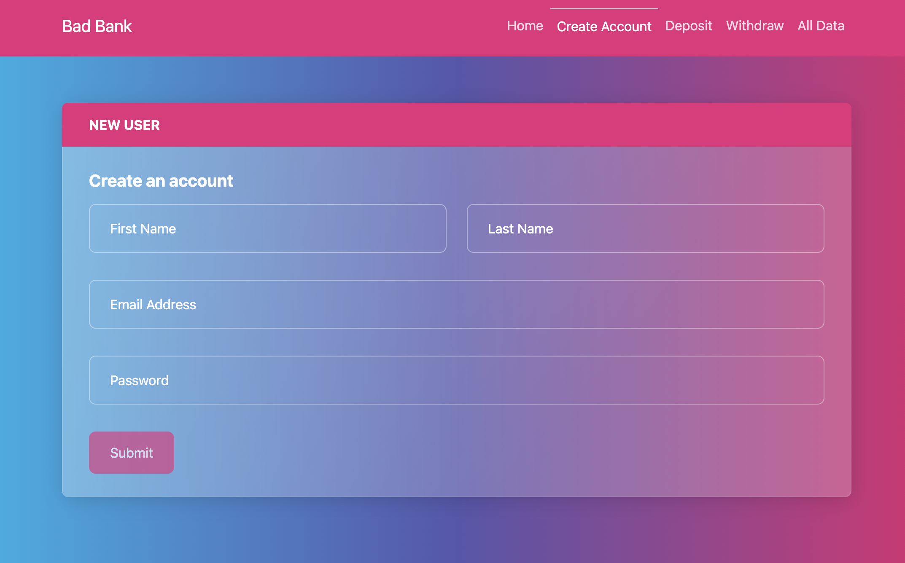

# :bank: Bad Bank

## :two_hearts: Description

This is a project completed as part of the MIT xPro Full Stack Development with MERN curriculum, in order to learn the basics of building a web app from scratch. 

## Installation Guidelines

Save the files locally - you will find instructions within the 'assets' folder. 

## Technology used

Create React App, Bootstrap, React-Bootstrap, Formik, Yup, React Router, ESLint, Prettier, Husky

## Features
### Current
Track deposits, withdrawals, balance, log in/out, create user, display all data (persistent for multiple users); fully responsive

### Future
[ ] Implement backend
[ ] Change color scheme and placeholder graphics

## :copyright: License information
MIT License

Copyright (c) 2022 helloaimee

Permission is hereby granted, free of charge, to any person obtaining a copy
of this software and associated documentation files (the "Software"), to deal
in the Software without restriction, including without limitation the rights
to use, copy, modify, merge, publish, distribute, sublicense, and/or sell
copies of the Software, and to permit persons to whom the Software is
furnished to do so, subject to the following conditions:

The above copyright notice and this permission notice shall be included in all
copies or substantial portions of the Software.

THE SOFTWARE IS PROVIDED "AS IS", WITHOUT WARRANTY OF ANY KIND, EXPRESS OR
IMPLIED, INCLUDING BUT NOT LIMITED TO THE WARRANTIES OF MERCHANTABILITY,
FITNESS FOR A PARTICULAR PURPOSE AND NONINFRINGEMENT. IN NO EVENT SHALL THE
AUTHORS OR COPYRIGHT HOLDERS BE LIABLE FOR ANY CLAIM, DAMAGES OR OTHER
LIABILITY, WHETHER IN AN ACTION OF CONTRACT, TORT OR OTHERWISE, ARISING FROM,
OUT OF OR IN CONNECTION WITH THE SOFTWARE OR THE USE OR OTHER DEALINGS IN THE
SOFTWARE.
